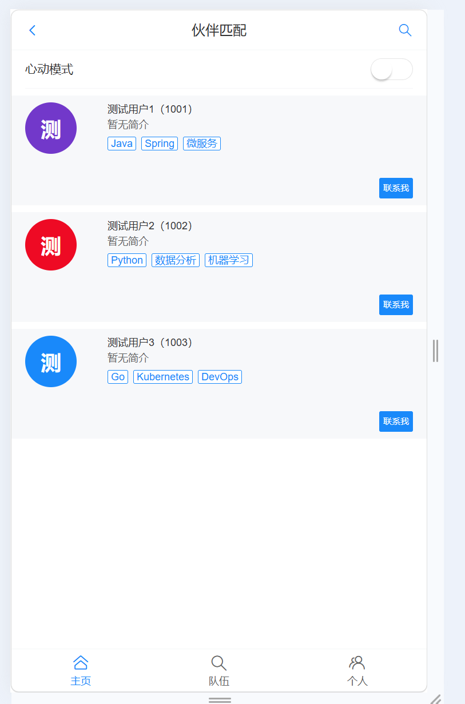

# 鱼泡伙伴网 前端部分 前端开发者

使用Vue3 + TypeScript + Vant4 +Redis 使用分布式开发,这是前端部分
这是一个网页版的应用，可以在手机上打开，用来找人组队或者找伙伴一起玩。

👤 首页：推荐一些用户给你认识  
👥 队伍：可以创建或加入各种群组  
🙍 个人中心：管理自己的信息  
浏览其他用户的信息
🔍 根据标签搜索想找的人（比如"大一"、"Java"）
💕 开启"心动模式"智能匹配
👥 创建自己的队伍
🤝 加入别人的队伍
✏️ 修改自己的个人信息

#### 核心功能模块

1. 1.1用户模块
   用户登录注册,个人信息查看与编辑,个人中心管理
   2.2 匹配模块
   普通模式：分页推荐用户列表,心动模式：基于标签的智能匹配推荐,标签搜索：多条件树形标签筛选
   2.3 队伍模块
   队伍浏览（公开/加密分类）,创建、更新、删除队伍,加入/退出队伍,我创建的队伍、我加入的队伍
   
   
   
    2.心动模式
   选择感兴趣的标签
   
   开启心动模式筛选用户
   

#### 主要是学习项目结构设计

了解如何做项目,整个项目是如何运行的?
如何创建页面?
如何请求数据?
如何展示数据?
如何处理用户操作?

┌──────────────────┐
│ 前端（我的项目） │ ← 已经写好了
└────────┬─────────┘
│ 网络请求
↓
┌──────────────────┐
│ 后端（同学写） │ ← 需要提供接口
│ (Spring Boot) │
└──────────────────┘
↓
┌──────────────────┐
│ 数据库 (MySQL) │ ← 存储数据
└──────────────────┘
package.json → 了解技术栈
main.ts → 了解入口
App.vue → 看根组件
route.ts → 看路由配置  
 Index.vue → 看第一个页面
BasicLayout.vue → 看布局组件
myAxios.ts → 看网络请求
业务组件/页面 → 看具体功能
