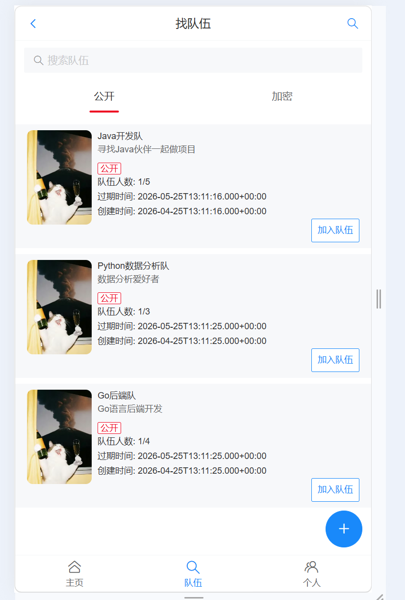
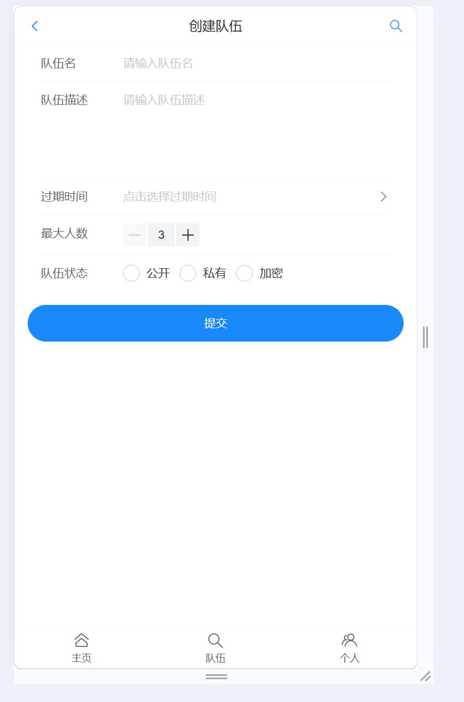
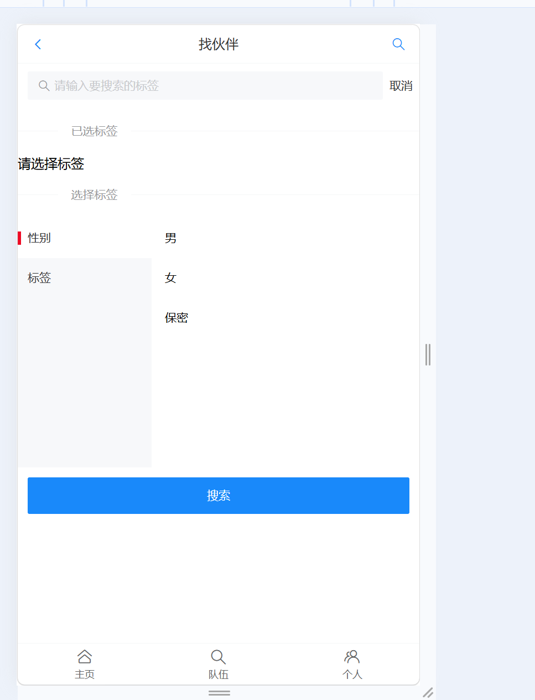
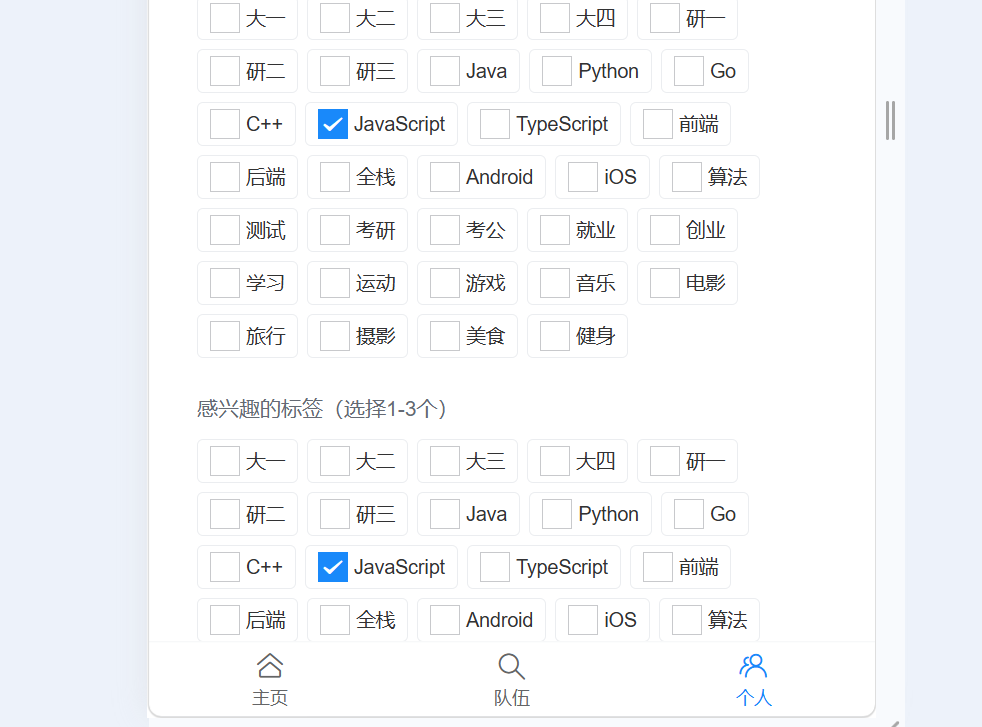
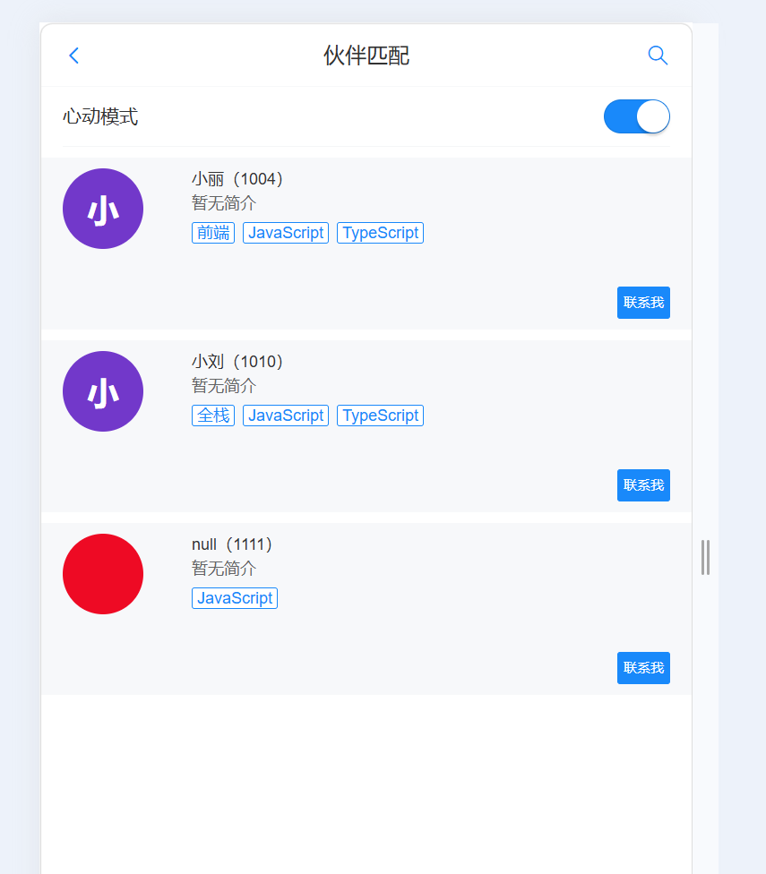

# 鱼泡伙伴网 - 前端

基于 **Vue 3 + TypeScript + Vant 3** 的移动端 H5 伙伴匹配平台，支持用户管理、标签匹配、队伍创建与加入等功能。

> 后端：Spring Boot  \|  数据库：MySQL

---

## 快速开始

```bash
# 安装依赖
npm install

# 启动开发服务器（默认 http://localhost:3000）
npm run dev

# 构建生产包
npm run build
```

> 后端接口地址默认为 `http://localhost:8080/api`，在 `src/plugins/myAxios.ts` 中配置。

---

## 项目结构

```
yupao-frontend/
├── index.html                    # 入口 HTML
├── vite.config.ts                # Vite 构建配置
├── tsconfig.json                 # TypeScript 配置
├── package.json                  # 依赖管理
├── global.css                    # 全局样式
│
├── public/                       # 静态资源（不经过构建）
│   ├── favicon.ico
│   ├── tags.json                # 标签数据（前后端解耦）
│   ├── gender.json              # 性别选项
│   └── team-status.json         # 队伍状态枚举
│
└── src/
    ├── main.ts                   # 应用入口
    ├── App.vue                   # 根组件
    ├── env.d.ts                  # 环境类型声明
    │
    ├── config/
    │   └── route.ts              # 路由配置（13 条路由）
    │
    ├── layouts/
    │   └── BasicLayout.vue       # 布局壳（顶部导航 + 底部TabBar）
    │
    ├── pages/                    # 页面组件（14 个）
    │   ├── Index.vue             # 首页（推荐 + 心动模式）
    │   ├── SearchPage.vue        # 标签搜索页
    │   ├── SearchResultPage.vue  # 搜索结果页
    │   ├── TeamPage.vue          # 队伍列表页
    │   ├── TeamAddPage.vue       # 创建队伍页
    │   ├── TeamUpdatePage.vue    # 更新队伍页
    │   ├── UserPage.vue          # 个人中心
    │   ├── UserUpdatePage.vue    # 修改个人信息
    │   ├── UserEditPage.vue      # 编辑单个字段
    │   ├── UserLoginPage.vue     # 登录页
    │   ├── UserRegisterPage.vue  # 注册页
    │   ├── UserTeamCreatePage.vue # 我创建的队伍
    │   └── UserTeamJoinPage.vue  # 我加入的队伍
    │
    ├── components/               # 公共组件（3 个）
    │   ├── UserCardList.vue      # 用户卡片列表（骨架屏 + 头像 + 标签）
    │   ├── TeamCardList.vue      # 队伍卡片列表（加入/退出/解散/更新）
    │   └── TagEditor.vue         # 标签编辑器（v-model 双向绑定）
    │
    ├── plugins/
    │   └── myAxios.ts            # Axios 封装 + 拦截器 + 类型增强
    │
    ├── services/
    │   └── user.ts               # 用户 API 服务
    │
    ├── states/
    │   └── user.ts               # 全局用户状态（ref 响应式）
    │
    ├── utils/
    │   └── tags.ts               # 标签解析工具函数
    │
    ├── models/                   # TypeScript 类型定义
    │   ├── user.d.ts
    │   └── team.d.ts
    │
    ├── constants/
    │   └── team.ts               # 队伍状态枚举常量
    │
    └── types/
        └── css-nodules.d.ts      # CSS 模块类型声明
```

---

## 页面截图

### 首页（推荐 + 心动模式）



### 找队伍（公开 / 加密分类）



### 个人信息 / 标签管理



### 心动模式 — 选择感兴趣的标签



### 心动模式 — 开启后匹配结果



---

## 技术栈

| 技术 | 版本 | 用途 |
|------|------|------|
| Vue | 3.2 | 前端框架（Composition API + `<script setup>`） |
| TypeScript | 4.5 | 类型系统 |
| Vant | 3.4 | 移动端 UI 组件库 |
| Vue Router | 4 | 路由管理 |
| Axios | 0.27 | HTTP 请求 |
| Vite | 2.9 | 构建工具 |
| qs | 6.10 | 查询字符串序列化 |

---

## 功能模块

### 👤 用户模块

| 功能 | 页面 | 说明 |
|------|------|------|
| 登录 | `UserLoginPage` | 账号密码登录，401 自动跳转 |
| 注册 | `UserRegisterPage` | 注册新账号，含两次密码校验 |
| 个人信息 | `UserPage` | 彩色首字母头像、简介展开/收起 |
| 编辑资料 | `UserEditPage` | 动态路由参数驱动，一个页面编辑多个字段 |
| 标签管理 | `UserPage` | Checkbox 多选（最多 3 个），带感兴趣的标签 |
| 性别修改 | `UserPage` / `UserUpdatePage` | ActionSheet 弹窗选择，即时更新 |

### 💕 匹配模块

| 功能 | 页面 | 说明 |
|------|------|------|
| 普通推荐 | `Index` | 分页查询用户列表 |
| 心动模式 | `Index` | van-switch 切换，基于标签智能匹配 |
| 标签搜索 | `SearchPage` | van-tree-select 两级树形筛选 |
| 搜索结果 | `SearchResultPage` | 按标签查询用户 |

### 👥 队伍模块

| 功能 | 页面 | 说明 |
|------|------|------|
| 队伍列表 | `TeamPage` | 公开/加密分类，搜索过滤 |
| 创建队伍 | `TeamAddPage` | 名称、描述、过期时间、人数、状态、密码 |
| 更新队伍 | `TeamUpdatePage` | 加载已有信息后修改 |
| 加入/退出 | `TeamCardList` | 加密队伍需密码弹窗 |
| 解散队伍 | `TeamCardList` | 仅创建者可见 |
| 我创建的 | `UserTeamCreatePage` | 查看自己创建的队伍 |
| 我加入的 | `UserTeamJoinPage` | 查看已加入的队伍 |

---

## 数据流设计

```
用户操作
    │
    ▼
Vue 组件（页面/组件）
    │
    ├─ 调用 myAxios.get() / post() / put() / delete()
    │
    ▼
请求拦截器
    │
    ▼
HTTP 请求 → http://localhost:8080/api/xxx
    │
    ▼
响应拦截器
    ├─ code === 40100 → 跳转登录页（带 redirect 参数）
    └─ 返回 response.data  →  { code, data, message }
          │
          ▼
组件接收 ApiResponse<T>
    ├─ code === 0 → 成功，使用 data
    └─ code !== 0 → Toast 提示失败
```

---

## 组件通信方式

| 方式 | 方向 | 示例 |
|------|------|------|
| Props | 父 → 子 | `Index.vue` 传 `:user-list` 给 `UserCardList.vue` |
| Emits | 子 → 父 | `TeamCardList.vue` 发射 `@refresh`，父组件重新请求数据 |
| v-model | 双向 | `TagEditor.vue` 绑定标签数组 |

---

## 学习路线

建议按以下顺序阅读源代码，理解项目是如何运作的：

| 序号 | 文件 | 学什么 |
|------|------|--------|
| 1 | `package.json` | 了解技术栈和依赖关系 |
| 2 | `src/main.ts` | 应用入口：创建实例、注册路由和 UI 库 |
| 3 | `src/App.vue` | 根组件：只有一个布局壳 |
| 4 | `src/config/route.ts` | 路由配置：13 个页面如何映射到 URL |
| 5 | `src/layouts/BasicLayout.vue` | 布局组件：导航栏 + 路由视图 + 底部TabBar + 路由守卫动态标题 |
| 6 | `src/plugins/myAxios.ts` | 网络请求封装：拦截器、类型增强、401 自动处理 |
| 7 | `src/pages/Index.vue` | 第一个业务页面：数据加载、条件渲染、组件使用 |
| 8 | `src/components/UserCardList.vue` | 公共组件：Props 接收数据、骨架屏加载、标签解析 |
| 9 | `src/components/TeamCardList.vue` | 复杂组件：Props + Emits + 条件按钮 + 密码弹窗 |
| 10 | `src/utils/tags.ts` | 工具函数：标签格式兼容（JSON / 逗号分隔） |

---

## API 端点汇总

| 方法 | 路径 | 用途 |
|------|------|------|
| GET | `/user/current` | 获取当前用户 |
| GET | `/user/recommend` | 分页推荐用户 |
| POST | `/user/match/tags` | 心动模式匹配 |
| GET | `/user/search/tags` | 按标签搜索用户 |
| POST | `/user/login` | 用户登录 |
| POST | `/user/register` | 用户注册 |
| POST | `/user/update` | 更新用户信息 |
| GET | `/team/list` | 队伍列表 |
| GET | `/team/get` | 获取单个队伍 |
| POST | `/team/add` | 创建队伍 |
| POST | `/team/update` | 更新队伍 |
| POST | `/team/join` | 加入队伍 |
| POST | `/team/quit` | 退出队伍 |
| POST | `/team/delete` | 解散队伍 |
| GET | `/team/list/my/create` | 我创建的队伍 |
| GET | `/team/list/my/join` | 我加入的队伍 |
